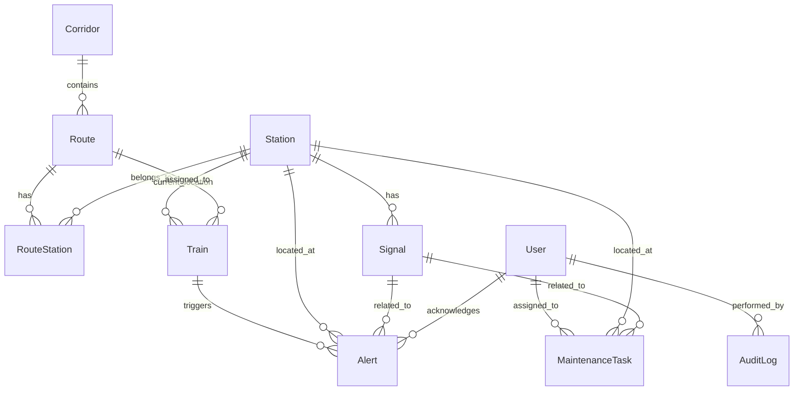

# RailMind AI — Database Schema Reference

> This file is auto-maintained. See `backend/app/models/` for the SQLAlchemy source of truth.

## Entity Relationship Diagram

## Tables

| Table | Description | Key Indexes |
|-------|-------------|-------------|
| `users` | Platform users with role-based access | `email` (unique), `username` (unique) |
| `corridors` | Railway corridors (e.g., SC-KZJ-BZA) | `code` (unique) |
| `stations` | Railway stations with GPS coordinates | `code` (unique) |
| `routes` | Named routes within corridors | `code` (unique), `corridor_id` (FK) |
| `route_stations` | Junction table: route ↔ station ordering | `route_id` + `station_id` (unique), `sequence_order` |
| `signals` | Railway signals at stations | `station_id` (FK), `signal_type` |
| `trains` | Train entities with real-time state | `number` (unique), `route_id` (FK), `status` |
| `alerts` | Operational alerts and warnings | `severity`, `created_at`, `acknowledged` |
| `maintenance_tasks` | Scheduled and completed maintenance | `status`, `priority`, `due_date` |
| `audit_logs` | User action audit trail | `user_id` (FK), `created_at`, `entity_type` |

## Data Source Policy

Every data entity includes a `data_source` field with one of:
- `verified_railway_data` — Cross-referenced from official/open sources
- `simulation` — Generated for simulation purposes
- `external_api` — From third-party API integration
